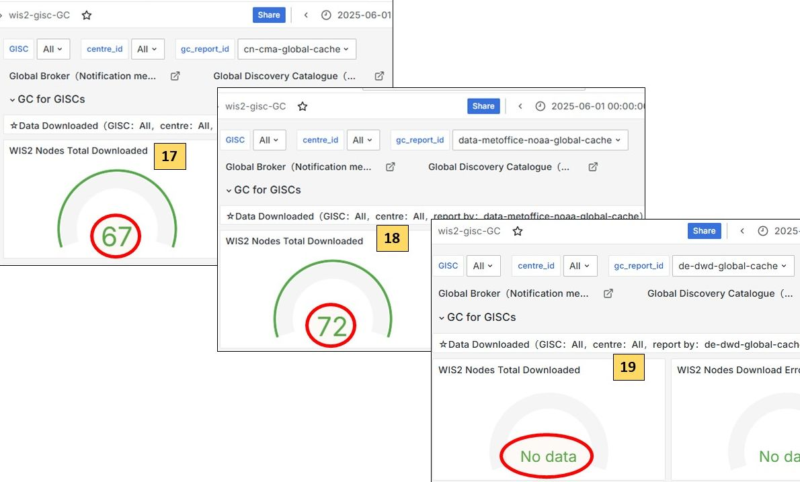

== PART II.Procedures for Monitor
Procedure to use by the GISC on duty during the monitoring period.

Basic Principles:

1. The GISC Watch’s goal is focusing on the Global Services level (Global Broker, Global Cache, Global Discovery Catalogue, Global Monitoring).
2. Issues regarding data coming from WIS2Nodes are manages by GISCs according to their AoR (Area of Responsibility). The GISC Watch can pinpoint issues to the GISCs, but this is not mandatory.
3. A large part of the monitoring activity is already performed on the Global Monitoring level, with JIRA tickets to be automatically initiated.

The following table shall be filled in, by checking Global Monitoring metrics (see detailed information how to get the figures after the table):

*For GM-China Dashboard:*

image::images/GM-CHINA_01.JPG[]

image::images/GM-CHINA_03.JPG[]

image::images/GM-CHINA_04.JPG[]

image::images/GM-CHINA_05.JPG[]

image::images/GM-CHINA_06.JPG[]

image::images/GM-CHINA_08.JPG[]

image::images/GM-CHINA_09.JPG[]

*For GM-Morocco Dashboard:*

image::images/GM-Marocco_02.JPG[]

image::images/GM-Marocco_03.JPG[]

image::images/GM-Marocco_08.JPG[]

 
[frame=all,cols="1,1,1,1,1,1"]
|===
|Global Services|Test Source|Details|Roster Start|Optional additional dates|Roster end

3+|*Global Monitorings*|YYYY/MM/DD|...|YYYY/MM/DD
|GM CMA GISC|https://gm.wis.cma.cn|User: gisc_user|connect OK|...|connect OK
|GM CMA GS|https://gm.wis.cma.cn|User: gs_user|connect OK|...|connect OK
|GM MAROCMETEO GISC|https://wis2gmc.marocmeteo.ma/|User: gisc-user|connect OK|...|connect NOK

3+|*Global Brokers*|||
3+|Based on dashboard *WIS2-GISC/wis2-gisc-GB* (gisc_user) / Indicator: "WIS2Nodes Total Messages over past 24h"|YYYY/MM/DD|...|YYYY/MM/DD
|GB Brazil 2+|From GM China|63|...|64
|GB Brazil 2+|From GM MAROCMETEA|63|...|Not Available
|GB China 2+|From GM China|68|...|68
|GB China 2+|From GM MAROCMETEA |68|...|Not Available
|GB France 2+|From GM China |62|...|63
|GB France 2+|From GM MAROCMETEA |62|...|Not Available
|GB USA 2+|From GM China |46|...|52
|GB USA 2+|From GM MAROCMETEA |46|...|Not Available

3+|*Global Caches*|||
3+|Based on dashboard *WIS2-GISC/wis2-gisc-GC* (gisc_user) / Indicator: "WIS2Nodes Total downloaded over past 24h"|YYYY/MM/DD|...|YYYY/MM/DD
|GC CN CMA 2+|From GM China|No data|...|No data
|GB CN CMA 2+|From GM MAROCMETEA |No data|...|No data
|GC MO NOAA US/UK 2+|From GM China|58|...|58
|GB MO NOAA US/UK 2+|From GM MAROCMETEA |58|...|58
|GC DE DWD 2+|From GM China|56|...|58
|GB DE DWD 2+|From GM MAROCMETEA |56|...|58
|GC JP JMA 2+|From GM China|57|...|58
|GB JP JMA 2+|From GM MAROCMETEA |57|...|58
|GC SA NCM 2+|From GM China|No data|...|59
|GB SA NCM 2+|From GM MAROCMETEA |No data|...|59

3+|*JIRA Ticketing System*|YYYY/MM/DD|...|YYYY/MM/DD
|Total "In Progress"|||No data|...|2
|Total "To Do"|||No data|...|2
|Total "Done"|||No data|...|2
|Total "In Review"|||No data|...|2
|Total "Triage"|(should be zero)||No data|...|2
|===

*How to fetch data from the dashboards:*

=== Global brokers data

=== Global caches data

image::images/01_LOGIN.jpeg[]
Log in as gisc_user

image::images/02_GC_Dashboard.jpeg[]
Click on Dashboards, then wis2-gisc-GC

image::images/03_GC-Data.jpeg[]
Select GC and read value

Check has to be performed at roster start and roster end. Additional dates can also be added. 
