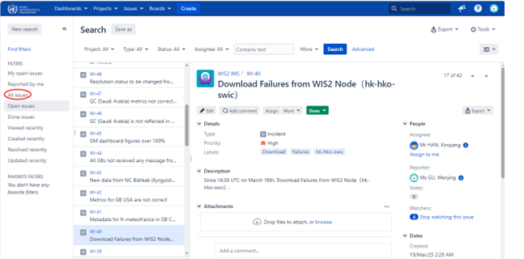

# Appendix 1: IMS-GISC Operator Manual

== 1. How to Login as External User

=== Step 1:
Access the login URL:  
https://jira.wmo.int/secure/Dashboard.jspa

image::images/Step1.1.png[]

=== Step 2:
Click on the **External Users** button.

image::images/Step1.2.png[]

=== Step 3:
You will be redirected to the login page. Enter your email and password as registered in our database.

image::images/Step1.3.png[]

== 2. How to Resolve an Issue

=== Step 1:
After logging in, you may find the issues assigned to you.

You can also find your issues by navigating to:
`User Profile -> Boards -> Only My Issues`

image::images/Step2.1.2.png[]

Alternatively, click on **Issues** in the top menu and select **My Open Issues** from the left panel.

=== Step 2:
The GISC Operator should:
- Check the issue.
- Assign it to the responsible person (e.g., HAN Xinqiang).
- Set the issue status from `Triage` to `TO DO`.

image::images/Step2.2.1.png[]

You can view the workflow by clicking on **View Workflow**.

image::images/Step2.2.3.png[]

=== Step 3:
The assignee (e.g., HAN Xinqiang) begins work on the issue and sets the status from `TO DO` to `IN PROGRESS`.

=== Step 4:
After addressing the issue, the assignee submits it for review:
- Set the status from `IN PROGRESS` to `IN REVIEW`.
- Assign the issue to the reviewer (e.g., XUE Lei).

The process history is visible in the comments below, along with Reporter, Assignee, Watchers, etc., on the right.

=== Step 5:
The reviewer (XUE Lei) reviews the issue, assigns it back to the original handler (e.g., HAN Xinqiang), and sets the status from `IN REVIEW` to `IN PROGRESS`.

image::images/Step2.5.1.png[]

=== Step 6:
The assignee receives the feedback, completes any follow-up, and sets the status from `IN PROGRESS` to `DONE`.

The issue is now successfully resolved.

image::images/Step2.6.1.png[]

== 3. How to Create an Issue

=== Step 1:
In the user interface, click **Create**, describe the problem in detail using graphics and/or text, set the **Priority**, and assign the issue to the relevant GISC.

=== Step 2:
Add a comment to further explain the issue.

image::images/Step3.2.1.png[]

=== Step 3:
Add a Due Date as needed

image::images/Step3.3.1.png[]

